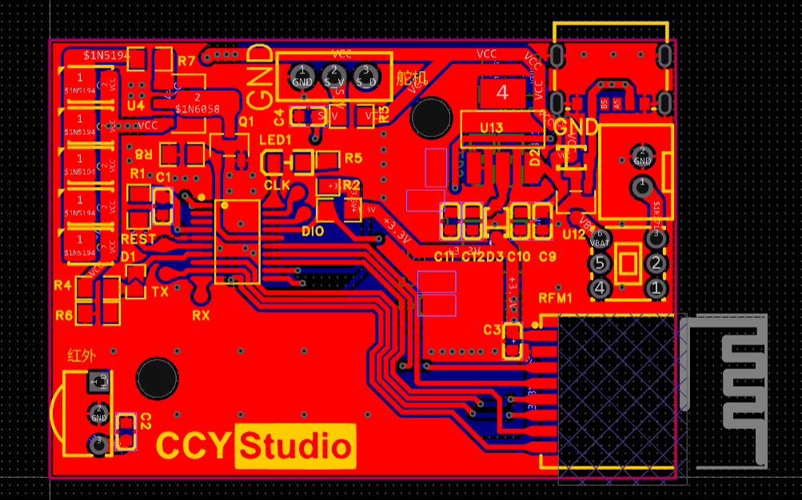
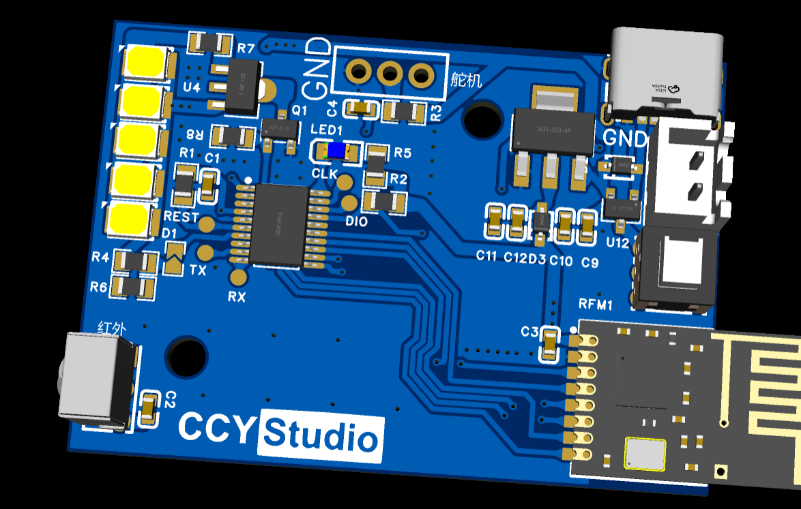

# ST-HLC
### STM32 室内灯光控制器

#### 引言

>室内的灯光开光如果距离比较远又不想走过去关灯，觉得就很麻烦。如果可以远程控制室内灯光的开关所以此项目由此而生。

#### 功能

1. 板载5颗单0.5W的LED灯珠 （除了控制舵机外，板载LED也是一个选择）
2. 红外接收头 （VS1838B） 使用红外遥控器进行控制
3. RF2.5G的无线模块 （后期支持，本期实现但是硬件预留了焊盘）
4. SG90舵机接口 （可以控制舵机实现墙上开关的打开与关闭）
5. 带充电芯片，可外接电池进行充电。充电口Type-c
6. 外接3.7v锂电池
7. 电池电压ADC检测
8. 主控芯片 STM32G030F6P6

---

如果需要PCB和原理图可联系我。

**联系邮箱：yustart@foxmail.com**

**QQ交流群： 676436122**
